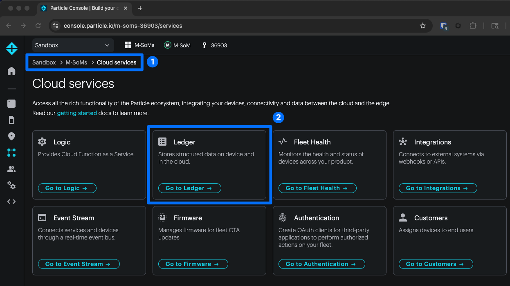
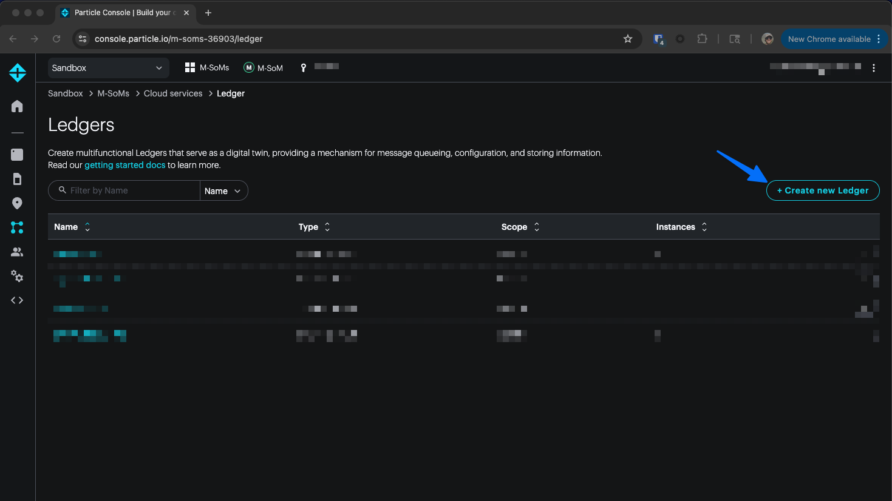
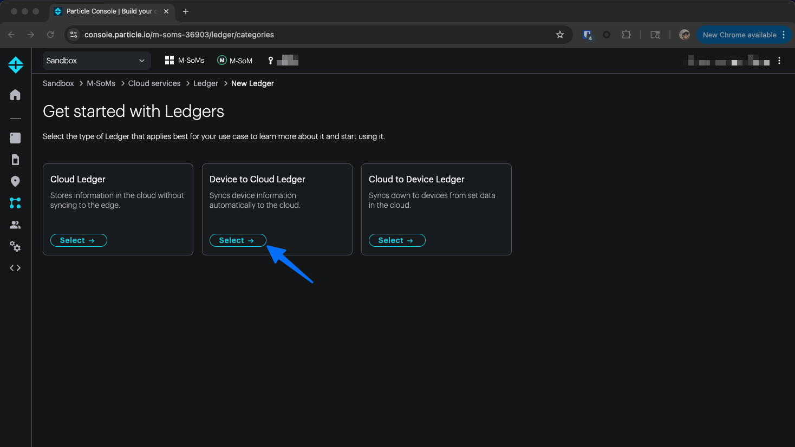
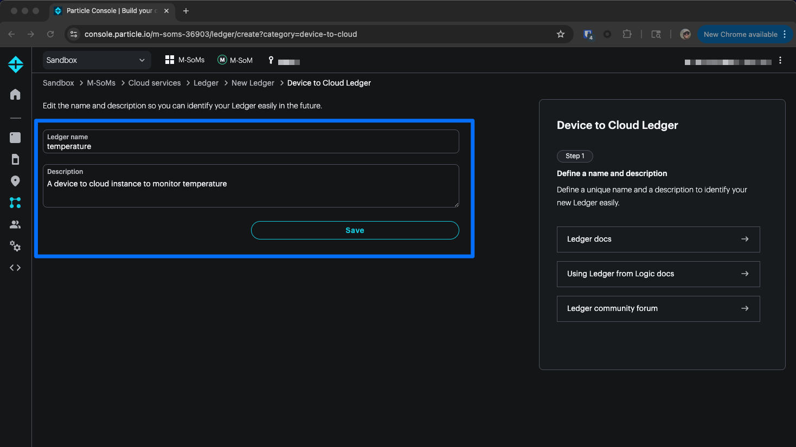
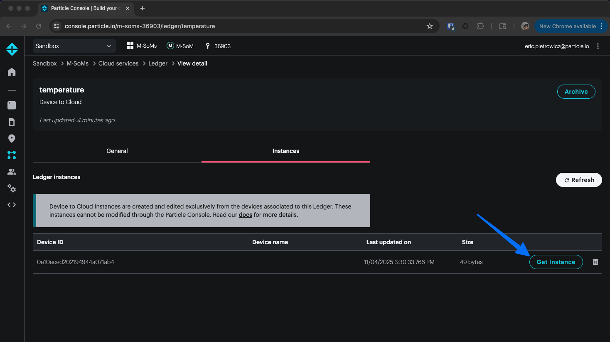

# Blueprint - Intermediate - Temperature Device to Cloud Ledger

**Difficulty:** Intermediate

**Estimated Time:** 30 minutes

**Hardware Needed:** Muon

---

### Overview

This blueprint shows how to use a Device to Cloud Ledger with the Muon's onboard TMP112A I2C temperature sensor.

---

## Tools & Materials

- [Particle Muon](https://store.particle.io/collections/all-products/products/test-noram-muoncbkit-bundle)
- [Particle Workbench](https://docs.particle.io/workbench/) or [Particle CLI](https://docs.particle.io/tutorials/developer-tools/cli/)
- A Particle account with a claimed device

---

## Steps

1. **Make a Device to Cloud Ledger instance** named `temperature`:

   1. Navigate to the Ledger cloud service
      
   2. Create a new Ledger
      
   3. Choose Device to Cloud Ledger
      
   4. Give the new Ledger a name and a description
      

2. **Clone this repository:**
   ```bash
   git clone https://github.com/particle-iot/blueprint-intermediate-temperature-ledger.git
   cd blueprint-intermediate-temperature-ledger
   ```
3. **Open the project** in Particle Workbench or your preferred editor.
4. **Flash the firmware** to your device:
   ```bash
   particle flash <device-name>
   ```
5. **Open a serial terminal** at 115200 baud (8N1):
   ```bash
   particle serial monitor --follow
   ```
6. **Observe output** in your terminal. You’ll see a timestamped line like:
   ```
   0000010545 [app] INFO: Temperature: 26.88 C / 80.38 F
   ```
7. **Get Ledger instance** for the device:
   1. Back in the Particle console, navigate to your `temperature` Ledger and choose "Get Instance"
      
      

---

### Expected Output

```
0000010246 [system.ledger] INFO: Requesting ledger info
0000010499 [system.ledger] INFO: Received ledger info
0000010545 [app] INFO: Temperature: 26.88 C / 80.38 F
0000071021 [app] INFO: Temperature: 26.94 C / 80.49 F
0000131493 [app] INFO: Temperature: 26.88 C / 80.38 F
```

### How It Works

The Muon's onboard I2C TMP112A temperature sensor is initialized and read by the following two function definitions:

```cpp
void initializeTemperature()
{
  Wire.begin();
  Wire.beginTransmission(TMP112A_ADDR);

  // Select configuration register
  Wire.write(0x01);
  // Continuous conversion, comparator mode, 12-bit resolution
  Wire.write(0x60);
  Wire.write(0xA0);
  // Stop I2C Transmission
  Wire.endTransmission();
  delay(300);
}

void readTemperature(TemperatureReading *reading)
{
  unsigned data[2] = {0, 0};

  // Start I2C Transmission
  Wire.beginTransmission(TMP112A_ADDR);
  // Select data register
  Wire.write(0x00);
  // Stop I2C Transmission
  Wire.endTransmission();
  delay(300);

  // Request 2 bytes of data
  Wire.requestFrom(TMP112A_ADDR, 2);

  // Read 2 bytes of data
  // temp msb, temp lsb
  if (Wire.available() == 2)
  {
    data[0] = Wire.read();
    data[1] = Wire.read();
  }

  // Convert the data to 12-bits
  int temp = ((data[0] * 256) + data[1]) / 16;
  if (temp > 2048)
  {
    temp -= 4096;
  }
  float cTemp = temp * 0.0625;
  float fTemp = cTemp * 1.8 + 32;

  reading->degreesC = cTemp;
  reading->degreesF = fTemp;
}
```

The `temperature` Ledger is assigned in `setup`:

```cpp
// setup() runs once, when the device is first turned on
void setup()
{
  // Put initialization like pinMode and begin functions here
  temperatureLedger = Particle.ledger("temperature");
}
```

If the device is connected to the Particle cloud, and the predetermined period has elapsed, then the `temperature` Ledger is updated with `tempC` and `tempF`:

```cpp
void loop()
{
  if (Particle.connected())
  {
    if ((lastPublish == 0) || (millis() - lastPublish >= publishPeriod.count()))
    {
      readTemperature(&tempReading);
      Log.info("Temperature: %.2f C / %.2f F", tempReading.degreesC, tempReading.degreesF);

      Variant data;
      data.set("tempF", tempReading.degreesF);
      data.set("tempC", tempReading.degreesC);
      if (Time.isValid())
      {
        data.set("time", Time.format(TIME_FORMAT_ISO8601_FULL)); // Time.format returns a String
      }
      temperatureLedger.set(data);
      lastPublish = millis();
    }
  }
}
```

---

### Topics Covered

- [Device to Cloud Ledger](https://docs.particle.io/getting-started/logic-ledger/ledger/#device-to-cloud-ledger-console)
- [USB serial debugging](https://docs.particle.io/firmware/best-practices/usb-serial/)
- [Wire (I2C)](https://docs.particle.io/reference/device-os/api/wire-i2c/pull-up-resistors-i2c/#wire-i2c-)

---

### Extensions

Try creating a rolling window of 10 temperature samples.
